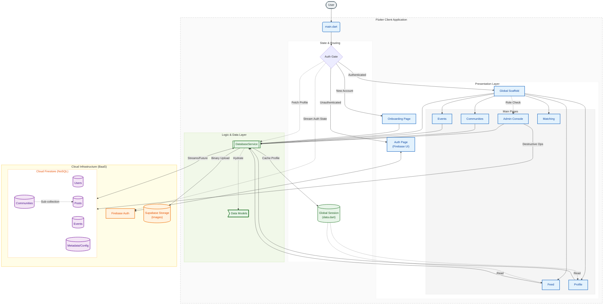
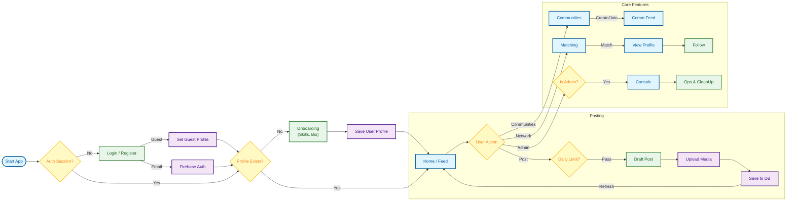

# College Coding Culture

- Started: 2025-12-26
- AI aid: Heavy

This project is to be submitted to the House of Innovation Hackathon conducted by GDG BIT Mesra, Jaipur.

## System Architecture

The application follows a **Service-Oriented Architecture (SOA)** on the client side, relying on Serverless/BaaS infrastructure.

## User Journey Flow

This diagram illustrates the process flow from the user's perspective, covering Authentication, Onboarding, and core feature loops.

